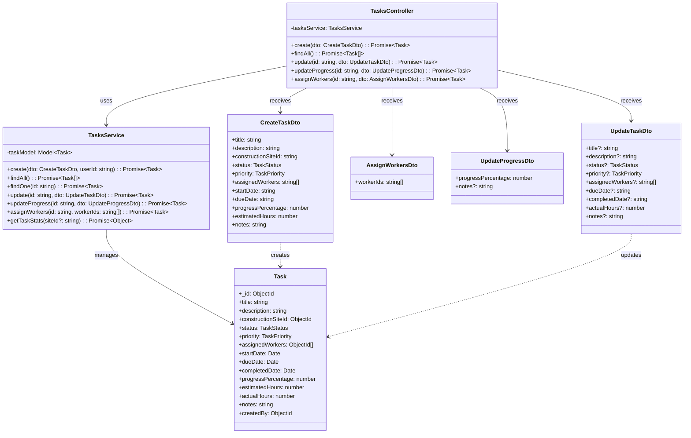
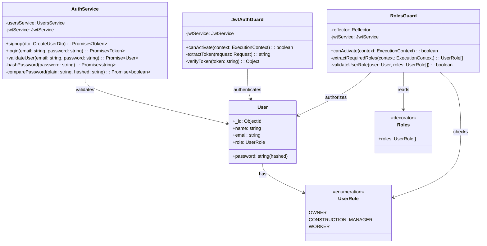
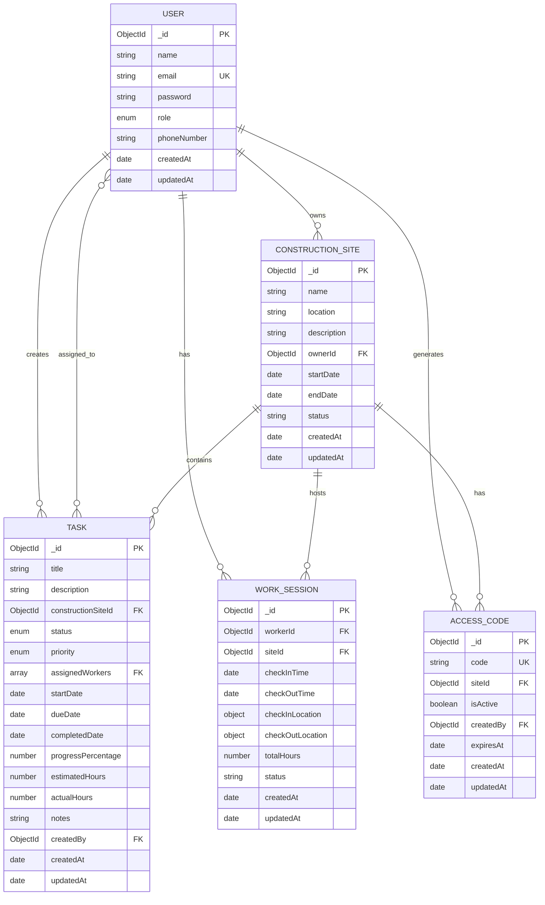
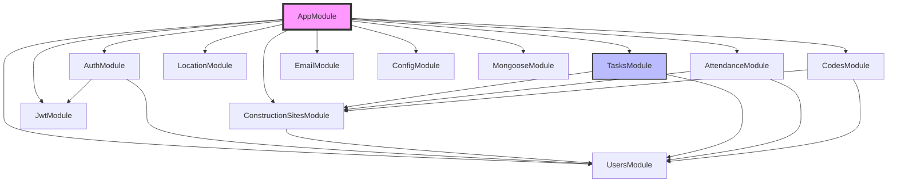

# Construction Management System - Class Diagrams

## Main Architecture Overview

```mermaid
classDiagram
    %% Main Application Module
    class AppModule {
        +imports: Module[]
        +controllers: Controller[]
        +providers: Provider[]
    }

    %% User Module
    class User {
        +_id: ObjectId
        +name: string
        +email: string
        +password: string
        +role: UserRole
        +phoneNumber: string
        +createdAt: Date
        +updatedAt: Date
    }

    class UserRole {
        <<enumeration>>
        OWNER
        CONSTRUCTION_MANAGER
        WORKER
    }

    class UsersService {
        +create(dto: CreateUserDto): Promise~User~
        +findAll(): Promise~User[]~
        +findOne(id: string): Promise~User~
        +findByEmail(email: string): Promise~User~
        +update(id: string, dto: UpdateUserDto): Promise~User~
        +remove(id: string): Promise~void~
    }

    class UsersController {
        +create(dto: CreateUserDto): Promise~User~
        +findAll(): Promise~User[]~
        +findOne(id: string): Promise~User~
        +update(id: string, dto: UpdateUserDto): Promise~User~
        +remove(id: string): Promise~void~
    }

    %% Construction Sites Module
    class ConstructionSite {
        +_id: ObjectId
        +name: string
        +location: string
        +description: string
        +ownerId: ObjectId
        +startDate: Date
        +endDate: Date
        +status: string
        +createdAt: Date
        +updatedAt: Date
    }

    class ConstructionSitesService {
        +create(dto: CreateConstructionSiteDto): Promise~ConstructionSite~
        +findAll(): Promise~ConstructionSite[]~
        +findOne(id: string): Promise~ConstructionSite~
        +findByOwner(ownerId: string): Promise~ConstructionSite[]~
        +update(id: string, dto: UpdateConstructionSiteDto): Promise~ConstructionSite~
        +remove(id: string): Promise~void~
    }

    class ConstructionSitesController {
        +create(dto: CreateConstructionSiteDto): Promise~ConstructionSite~
        +findAll(): Promise~ConstructionSite[]~
        +findOne(id: string): Promise~ConstructionSite~
        +findByOwner(ownerId: string): Promise~ConstructionSite[]~
        +update(id: string, dto: UpdateConstructionSiteDto): Promise~ConstructionSite~
        +remove(id: string): Promise~void~
    }

    %% Tasks Module
    class Task {
        +_id: ObjectId
        +title: string
        +description: string
        +constructionSiteId: ObjectId
        +status: TaskStatus
        +priority: TaskPriority
        +assignedWorkers: ObjectId[]
        +startDate: Date
        +dueDate: Date
        +completedDate: Date
        +progressPercentage: number
        +estimatedHours: number
        +actualHours: number
        +notes: string
        +createdBy: ObjectId
        +createdAt: Date
        +updatedAt: Date
    }

    class TaskStatus {
        <<enumeration>>
        NOT_STARTED
        IN_PROGRESS
        ON_HOLD
        COMPLETED
        CANCELLED
    }

    class TaskPriority {
        <<enumeration>>
        LOW
        MEDIUM
        HIGH
        URGENT
    }

    class TasksService {
        +create(dto: CreateTaskDto, userId: string): Promise~Task~
        +findAll(): Promise~Task[]~
        +findOne(id: string): Promise~Task~
        +findByConstructionSite(siteId: string): Promise~Task[]~
        +findByWorker(workerId: string): Promise~Task[]~
        +findByStatus(status: TaskStatus): Promise~Task[]~
        +update(id: string, dto: UpdateTaskDto): Promise~Task~
        +updateProgress(id: string, dto: UpdateProgressDto): Promise~Task~
        +updateStatus(id: string, status: TaskStatus): Promise~Task~
        +assignWorkers(id: string, workerIds: string[]): Promise~Task~
        +remove(id: string): Promise~void~
        +getOverdueTasks(): Promise~Task[]~
        +getTaskStats(siteId?: string): Promise~Object~
    }

    class TasksController {
        +create(dto: CreateTaskDto): Promise~Task~
        +findAll(): Promise~Task[]~
        +findOne(id: string): Promise~Task~
        +findByConstructionSite(siteId: string): Promise~Task[]~
        +findByWorker(workerId: string): Promise~Task[]~
        +findByStatus(status: TaskStatus): Promise~Task[]~
        +update(id: string, dto: UpdateTaskDto): Promise~Task~
        +updateProgress(id: string, dto: UpdateProgressDto): Promise~Task~
        +updateStatus(id: string, status: TaskStatus): Promise~Task~
        +assignWorkers(id: string, dto: AssignWorkersDto): Promise~Task~
        +remove(id: string): Promise~void~
        +getStats(siteId?: string): Promise~Object~
        +getOverdueTasks(): Promise~Task[]~
    }

    %% Attendance Module
    class WorkSession {
        +_id: ObjectId
        +workerId: ObjectId
        +siteId: ObjectId
        +checkInTime: Date
        +checkOutTime: Date
        +checkInLocation: Location
        +checkOutLocation: Location
        +totalHours: number
        +status: string
        +createdAt: Date
        +updatedAt: Date
    }

    class Location {
        +latitude: number
        +longitude: number
        +address: string
    }

    class AttendanceService {
        +checkIn(dto: CheckInDto): Promise~WorkSession~
        +checkOut(dto: CheckOutDto): Promise~WorkSession~
        +getDailyWorkSummaryById(workerId: string, from?: Date, to?: Date): Promise~Object~
        +registerFace(workerCode: string, buffer: Buffer): Promise~Object~
        +checkInWithFace(buffer: Buffer, siteId: string): Promise~WorkSession~
    }

    class AttendanceController {
        +checkIn(dto: CheckInDto): Promise~WorkSession~
        +checkOut(dto: CheckOutDto): Promise~WorkSession~
        +getDailySummary(workerId: string, from?: string, to?: string): Promise~Object~
        +registerFace(file: File, workerCode: string): Promise~Object~
        +checkInWithFace(file: File, siteId: string): Promise~WorkSession~
    }

    %% Auth Module
    class AuthService {
        +signup(dto: CreateUserDto): Promise~Object~
        +login(dto: LoginDto): Promise~Object~
        +validateUser(email: string, password: string): Promise~User~
        +generateToken(user: User): string
    }

    class AuthController {
        +signup(dto: CreateUserDto): Promise~Object~
        +login(dto: LoginDto): Promise~Object~
    }

    %% Access Code Module
    class AccessCode {
        +_id: ObjectId
        +code: string
        +siteId: ObjectId
        +isActive: boolean
        +createdBy: ObjectId
        +expiresAt: Date
        +createdAt: Date
        +updatedAt: Date
    }

    class CodesService {
        +generateCode(siteId: string, userId: string): Promise~AccessCode~
        +validateCode(code: string): Promise~boolean~
        +getCodesBySite(siteId: string): Promise~AccessCode[]~
    }

    %% Guards and Decorators
    class JwtAuthGuard {
        +canActivate(context: ExecutionContext): boolean
    }

    class RolesGuard {
        +canActivate(context: ExecutionContext): boolean
    }

    %% Location/WebSocket Module
    class LocationGateway {
        +handleConnection(client: Socket): void
        +handleDisconnect(client: Socket): void
        +handleLocationUpdate(data: LocationData): void
    }

    %% Relationships
    User --> UserRole : has
    UsersController --> UsersService : uses
    UsersService --> User : manages

    ConstructionSite --> User : ownedBy
    ConstructionSitesController --> ConstructionSitesService : uses
    ConstructionSitesService --> ConstructionSite : manages

    Task --> ConstructionSite : belongsTo
    Task --> User : assignedTo (many)
    Task --> User : createdBy
    Task --> TaskStatus : has
    Task --> TaskPriority : has
    TasksController --> TasksService : uses
    TasksService --> Task : manages

    WorkSession --> User : belongsTo (worker)
    WorkSession --> ConstructionSite : belongsTo
    WorkSession --> Location : has (checkIn/Out)
    AttendanceController --> AttendanceService : uses
    AttendanceService --> WorkSession : manages

    AccessCode --> ConstructionSite : belongsTo
    AccessCode --> User : createdBy
    CodesService --> AccessCode : manages

    AuthController --> AuthService : uses
    AuthService --> UsersService : uses
    AuthService --> User : validates

    TasksController --> JwtAuthGuard : protected by
    TasksController --> RolesGuard : protected by
    ConstructionSitesController --> JwtAuthGuard : protected by
    UsersController --> JwtAuthGuard : protected by
```

## Detailed Task Management Flow

## Authentication & Authorization Flow

## Database Schema Relationships

## Module Dependencies

## Legend

- **Blue boxes**: Recently added Task Management Module
- **Pink box**: Main Application Module
- **Arrows**: Dependencies and relationships
- **FK**: Foreign Key relationship
- **PK**: Primary Key
- **UK**: Unique Key

