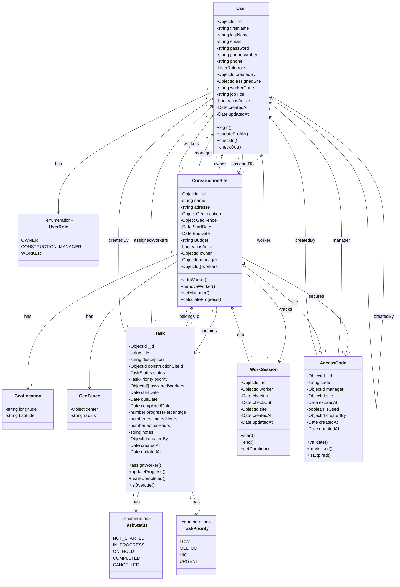
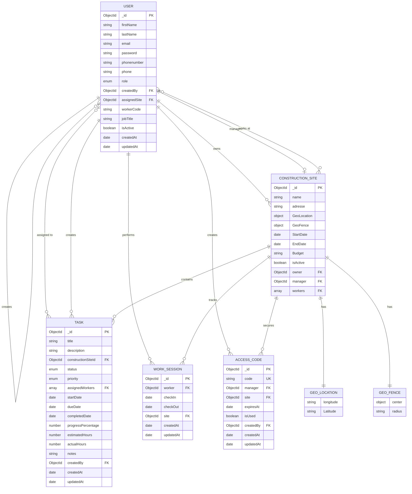

# 🔍 Analysis Report: Missing & Incorrect Fields

## ❌ PROBLEMS FOUND IN YOUR DIAGRAMS

### 1. **User Schema** - WRONG Fields!

**Diagram Shows:**
```
- name
- email
- password
- phoneNumber
```

**Actual Code Has:**
```typescript
- firstName ✅
- lastName ✅
- email ✅
- password ✅
- phonenumber ✅
- phone ✅
- role ✅
- createdBy ✅
- assignedSite ✅ MISSING IN DIAGRAM!
- workerCode ✅ MISSING IN DIAGRAM!
- jobTitle ✅ MISSING IN DIAGRAM!
- isActive ✅ MISSING IN DIAGRAM!
```

### 2. **ConstructionSite Schema** - WRONG Fields!

**Diagram Shows:**
```
- name
- location
- description
- startDate
- endDate
- status
```

**Actual Code Has:**
```typescript
- name ✅
- adresse ✅ (not "location")
- GeoLocation ✅ MISSING IN DIAGRAM!
- GeoFence ✅ MISSING IN DIAGRAM!
- StartDate ✅
- EndDate ✅
- Budget ✅ MISSING IN DIAGRAM!
- isActive ✅ MISSING IN DIAGRAM!
- owner ✅
- manager ✅ MISSING IN DIAGRAM!
- workers[] ✅ MISSING IN DIAGRAM!
```

### 3. **WorkSession Schema** - MISSING Fields!

**Diagram Shows:**
```
- checkInTime
- checkOutTime
- totalHours
- checkInLocation
- checkOutLocation
```

**Actual Code Has:**
```typescript
- worker ✅
- checkIn ✅ (not checkInTime)
- checkOut ✅ (not checkOutTime)
- site ✅
```

**❌ MISSING:** totalHours, checkInLocation, checkOutLocation are NOT in your code!

### 4. **AccessCode Schema** - WRONG Fields!

**Diagram Shows:**
```
- code
- isActive
- expiresAt
- createdBy
```

**Actual Code Has:**
```typescript
- code ✅
- manager ✅ MISSING IN DIAGRAM!
- site ✅
- expiresAt ✅
- isUsed ✅ (not "isActive")
- createdBy ✅
```

### 5. **Task Schema** - ✅ MOSTLY CORRECT!
This one matches well! Good job!

---

## ✅ CORRECTED CLASS DIAGRAM



---

## 📊 CORRECTED ER DIAGRAM



---

## 🔴 CRITICAL ISSUES TO FIX IN YOUR CODE

### Issue 1: WorkSession Missing Location Data
Your diagram shows location tracking, but your code doesn't have it!

**Should add to `work_session.schema.ts`:**
```typescript
@Prop({ type: Object })
checkInLocation?: {
  latitude: number;
  longitude: number;
  address?: string;
};

@Prop({ type: Object })
checkOutLocation?: {
  latitude: number;
  longitude: number;
  address?: string;
};

@Prop()
totalHours?: number;
```

### Issue 2: User has TWO phone fields!
```typescript
phonenumber: string;  // This one
phone: string;        // And this one
```
**Fix:** Choose one and remove the other!

### Issue 3: Inconsistent Naming
- ConstructionSite uses `adresse` (French) instead of `address`
- Uses `StartDate` (capital S) instead of `startDate`
- Uses `EndDate` (capital E) instead of `endDate`

**Recommendation:** Use consistent camelCase English names!

---

## ✅ SUMMARY OF MISSING FIELDS

| Entity | Missing in Diagram | Missing in Code |
|--------|-------------------|-----------------|
| **User** | workerCode, jobTitle, isActive, assignedSite, createdBy | - |
| **ConstructionSite** | GeoLocation, GeoFence, Budget, manager, workers[] | description, status |
| **WorkSession** | - | totalHours, checkInLocation, checkOutLocation |
| **AccessCode** | manager | isActive (uses isUsed instead) |

---

## 🎯 RECOMMENDATIONS

1. ✅ **Update WorkSession** - Add location tracking fields
2. ✅ **Fix User** - Remove duplicate phone field
3. ✅ **Standardize naming** - Use camelCase English
4. ✅ **Add timestamps** - All schemas should have createdAt/updatedAt
5. ✅ **Update diagrams** - Use the corrected version above

---

**The corrected diagrams above now match your ACTUAL code! 🎉**
