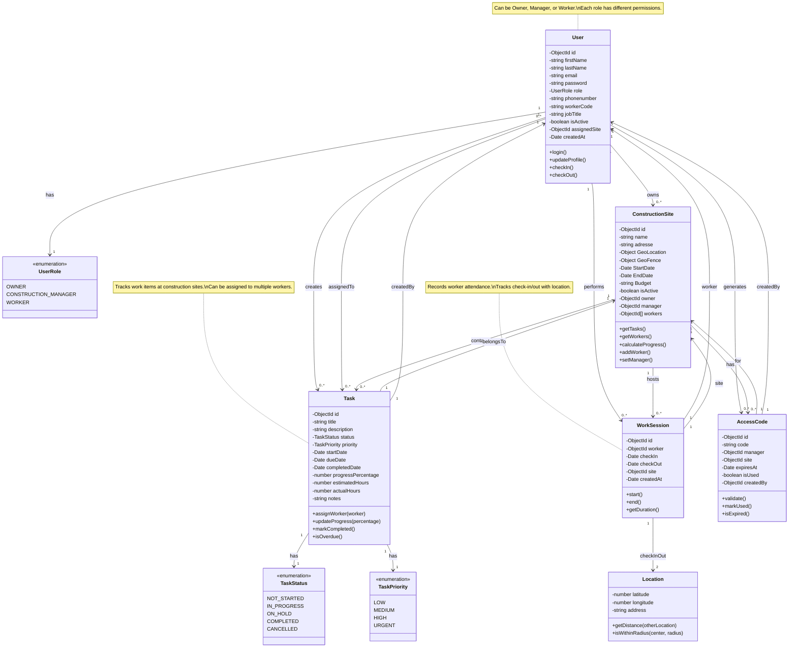
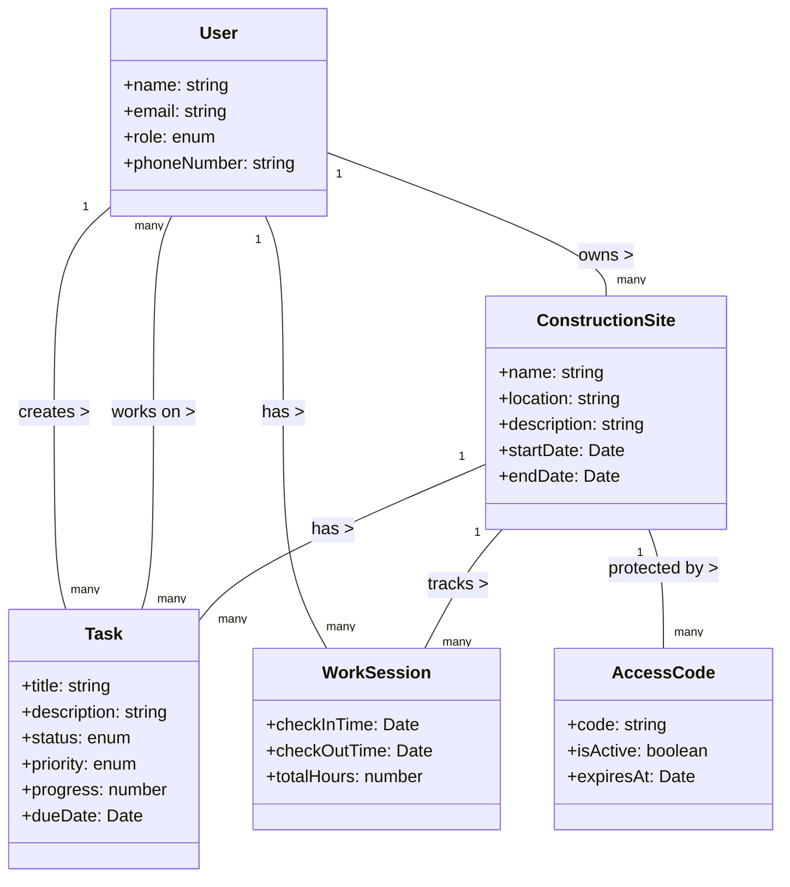
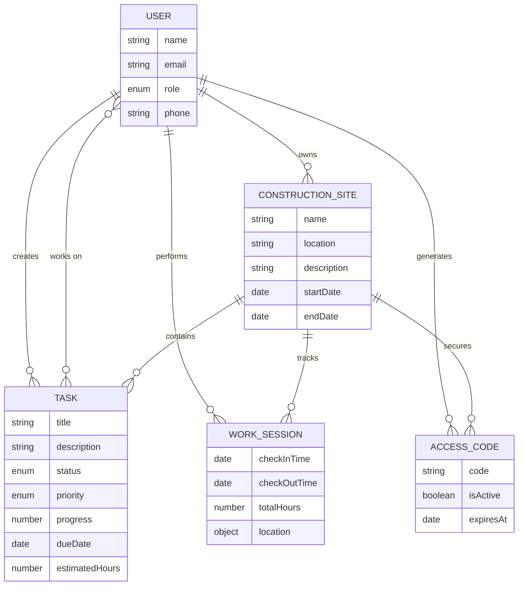
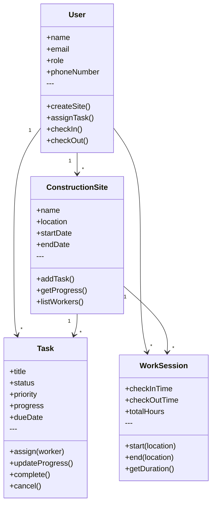
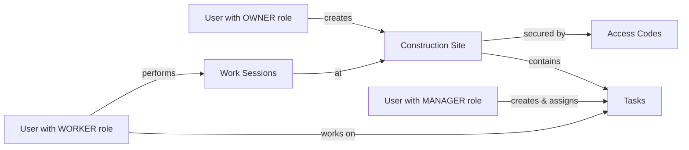

# Construction Management System - Domain Class Diagram

## Pure Business Domain Model (No Services/Controllers)

## Simplified Entity Relationship (No Technical Classes)

## Entity-Only Diagram (Just the Data)

## Domain Model with Behaviors

## Key Entities and Their Responsibilities

| Entity | Responsibility | Key Attributes |
|--------|---------------|----------------|
| **User** | People in the system (owners, managers, workers) | name, email, role |
| **ConstructionSite** | Physical construction locations | name, location, dates |
| **Task** | Work items to be completed | title, status, priority, progress |
| **WorkSession** | Worker attendance record | checkIn/Out times, hours |
| **AccessCode** | Security codes for site access | code, expiration |

## Relationships Explained

1. **User → ConstructionSite** (1:many)
   - One Owner owns many Construction Sites

2. **User → Task** (many:many)
   - One Manager creates many Tasks
   - Many Workers can be assigned to many Tasks

3. **ConstructionSite → Task** (1:many)
   - One Site contains many Tasks

4. **User → WorkSession** (1:many)
   - One Worker has many Work Sessions

5. **ConstructionSite → WorkSession** (1:many)
   - One Site tracks many Work Sessions

## Business Rules

**Notes:**
- Only **Owners** can create Construction Sites
- Only **Owners/Managers** can create and assign Tasks
- **Workers** can update task progress and perform work sessions
- All work sessions are linked to both a worker and a site
- Access codes control entry to construction sites

