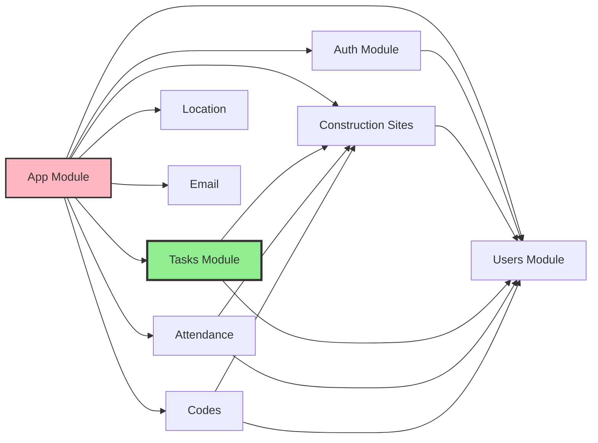
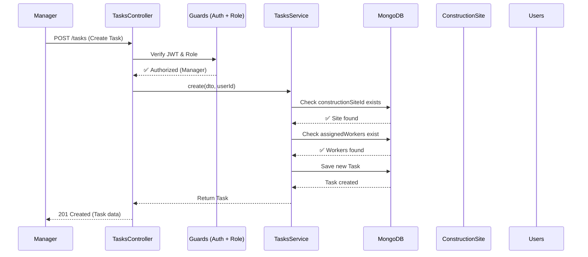
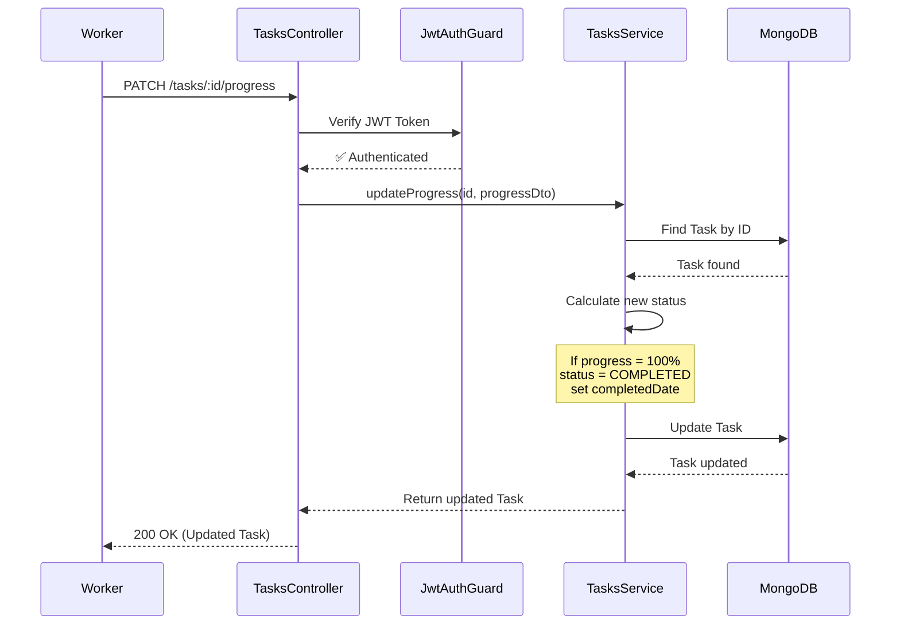
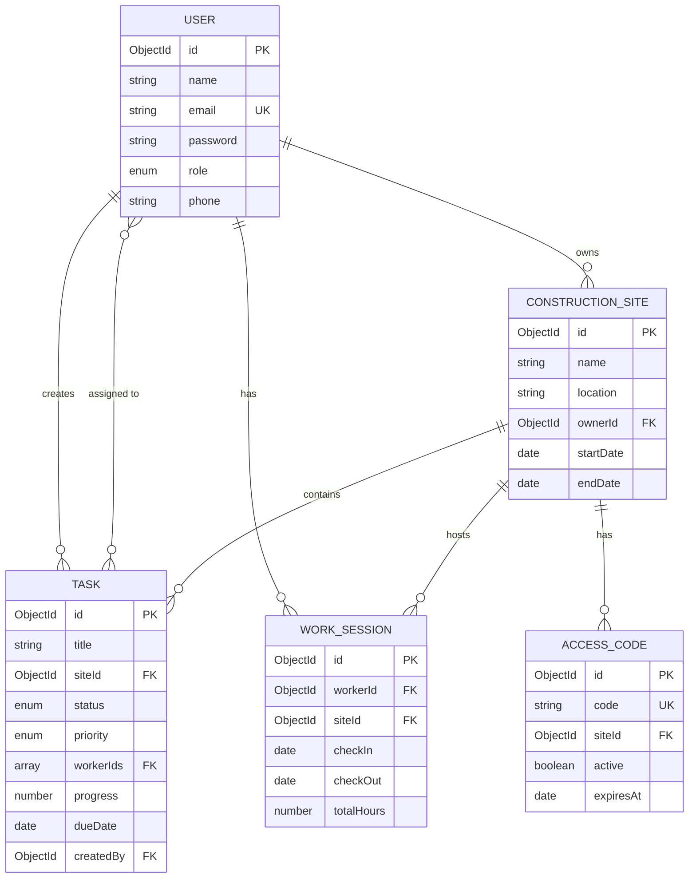
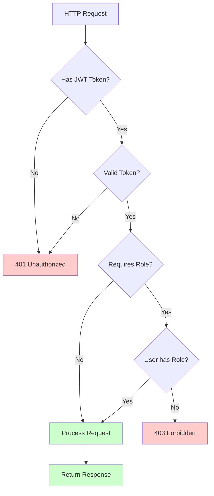
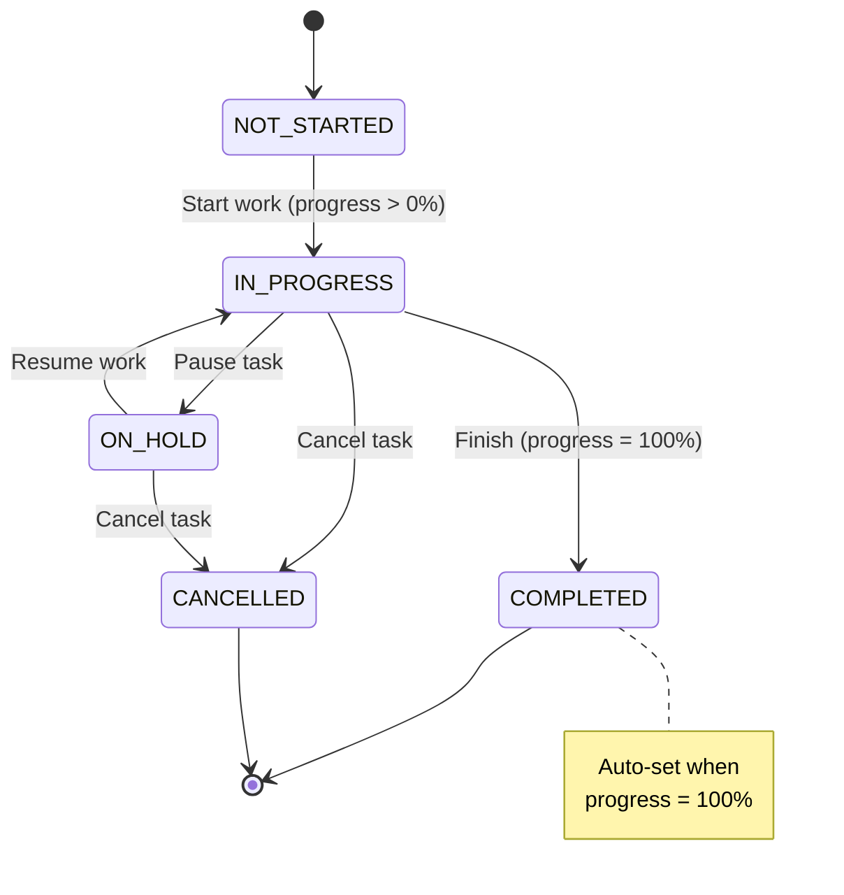

# Project Structure Diagram

## 📁 Construction Management Backend Architecture

```
Construction Management System
│
├── 🔐 Authentication Layer
│   ├── JWT Auth Guard
│   ├── Roles Guard
│   └── Auth Service (Login/Signup)
│
├── 👥 User Management
│   ├── Users (OWNER, MANAGER, WORKER)
│   ├── Roles & Permissions
│   └── User CRUD Operations
│
├── 🏗️ Construction Sites
│   ├── Site Management
│   ├── Site-Owner Relationship
│   └── Location Tracking
│
├── ✅ Task Management (NEW!)
│   ├── Create & Assign Tasks
│   ├── Track Progress (0-100%)
│   ├── Set Priorities & Deadlines
│   ├── Task Status Management
│   └── Statistics & Analytics
│
├── ⏰ Attendance System
│   ├── Check-In / Check-Out
│   ├── Face Recognition
│   ├── Location Verification
│   └── Work Hours Tracking
│
├── 🔑 Access Codes
│   ├── Generate Site Codes
│   ├── Validate Access
│   └── Code Expiration
│
├── 📍 Real-time Location
│   ├── WebSocket Gateway
│   ├── Live Worker Tracking
│   └── Location Updates
│
└── 📧 Email Service
    ├── Notifications
    └── System Alerts
```

## 🗂️ Module Relationships



## 🔄 Data Flow Example: Creating a Task



## 🎯 User Journey: Worker Updates Task Progress



## 🏗️ Database Schema Visual



## 🔐 Security Architecture



## 📊 Task Status State Machine



## 🎨 API Endpoints Overview

```
Authentication
├── POST   /auth/signup          → Register new user
└── POST   /auth/login           → Login & get JWT token

Users
├── GET    /users                → List all users
├── GET    /users/:id            → Get user details
├── POST   /users                → Create user
├── PATCH  /users/:id            → Update user
└── DELETE /users/:id            → Delete user

Construction Sites
├── GET    /construction-sites                → List all sites
├── GET    /construction-sites/:id            → Get site details
├── GET    /construction-sites/owner/:ownerId → Sites by owner
├── POST   /construction-sites                → Create site
├── PATCH  /construction-sites/:id            → Update site
└── DELETE /construction-sites/:id            → Delete site

Tasks (NEW!)
├── GET    /tasks                          → List all tasks
├── GET    /tasks/:id                      → Get task details
├── GET    /tasks/by-site/:siteId          → Tasks by site
├── GET    /tasks/by-worker/:workerId      → Tasks by worker
├── GET    /tasks/by-status/:status        → Tasks by status
├── GET    /tasks/overdue                  → Overdue tasks
├── GET    /tasks/stats?siteId=optional    → Task statistics
├── POST   /tasks                          → Create task
├── PATCH  /tasks/:id                      → Update task
├── PATCH  /tasks/:id/progress             → Update progress
├── PATCH  /tasks/:id/status               → Update status
├── PATCH  /tasks/:id/assign               → Assign workers
└── DELETE /tasks/:id                      → Delete task

Attendance
├── POST   /attendance/check-in            → Worker check-in
├── POST   /attendance/check-out           → Worker check-out
├── GET    /attendance/daily-summary       → Work summary
├── POST   /attendance/register-face       → Register face
└── POST   /attendance/checkin-face        → Check-in with face
```

## 💾 Technology Stack

```
Backend Framework
└── NestJS (TypeScript)
    ├── Express/Fastify
    └── Dependency Injection

Database
└── MongoDB
    └── Mongoose ODM

Authentication
├── JWT (JSON Web Tokens)
├── Passport
└── bcrypt (Password Hashing)

Real-time
├── Socket.IO
└── WebSockets

API Documentation
└── Swagger/OpenAPI

Validation
├── class-validator
└── class-transformer

Email
└── Nodemailer

External APIs
├── Axios (Face Recognition)
└── Location Services
```

## 🎯 Key Features Summary

| Feature | Status | Description |
|---------|--------|-------------|
| 👥 User Management | ✅ Complete | CRUD, roles, authentication |
| 🏗️ Construction Sites | ✅ Complete | Site management, ownership |
| ✅ Task Management | 🆕 NEW | Create, assign, track tasks |
| ⏰ Attendance | ✅ Complete | Check-in/out, face recognition |
| 🔑 Access Codes | ✅ Complete | Site access control |
| 📍 Location | ✅ Complete | Real-time tracking |
| 📧 Email | ✅ Complete | Notifications |
| 🔐 Security | ✅ Complete | JWT, roles, guards |

---

**Legend:**
- ✅ Complete and working
- 🆕 Newly added
- 🔐 Secured with authentication
- 📊 Has analytics/statistics

